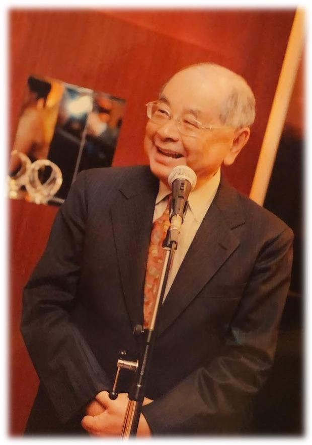

.. _h68017771fa7c85ef23567fe7b5a:

紀念鄭紹良博士
##############

\ |IMG1|\ 

.. _h791137197930656d4a307c1b41594e2e:

\ |IMG2|\ **********

.. _ha552d4339442b4514686d7839564:

\ |LINK1|\ 
***********

鄭紹良博士，生於1934年台灣澎湖，2019年8月16日驟逝於奧地利維也納，享年86歲。鄭紹良博士小時就讀馬公小學、馬公中學、於台灣大學土木系畢業、獲得美國西維吉尼亞大學土木結構碩士、華盛頓大學應用數學與電腦碩士、與華盛頓大學航空機械工程博士，專長為結構力學和人工智慧。  

 

	鄭紹良博士擁有美國土木工程師執照，曾任職於美國波音(Boeing)、麥道(McDonnell Douglas)、洛克爾公司(Rockwell)等航太飛機公司，負責多項軍事與商用飛機設計工程二十多年，參與過波音737,  747, B1轟炸機、C-17運輸巨機、太空梭等機體結構設計，多所貢獻;  曾領導人工智慧研究團隊，執行多項人工智慧的研究計畫，為早期人工智慧技術的理論基礎打樁奠基。

(\ |LINK2|\ ）

.. _hd1b83d48586e1b393a624e28544946:

紀念文
******

.. bottom of content

.. |LINK1| raw:: html

    <a href="https://drcheng.readthedocs.io/en/latest/003%E6%95%85%E4%BA%BA%E7%95%A5%E6%AD%B7.html" target="_blank">故人略歷</a>

.. |LINK2| raw:: html

    <a href="https://drcheng.readthedocs.io/en/latest/003%E6%95%85%E4%BA%BA%E7%95%A5%E6%AD%B7.html" target="_blank">閱讀全文</a>

